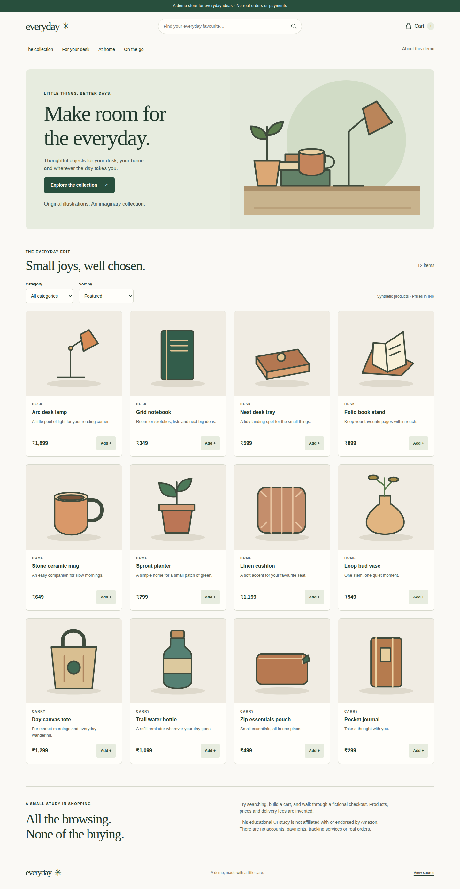
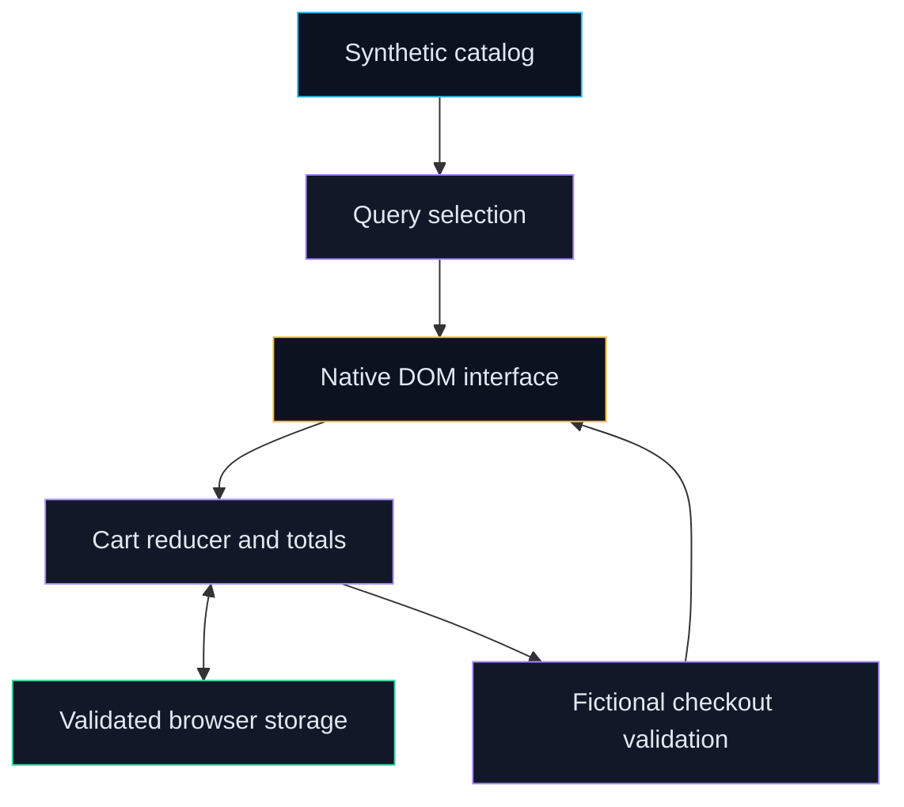

# Everyday storefront

A responsive educational store with a saved cart, simulated checkout, and reproducible browser quality measurements.

[](https://github.com/Prajwal-Pratap-Yadav/Amazon-Clone-Demo-Project/actions/workflows/ci.yml)
[](LICENSE)




Actual Chromium capture from `scripts/capture.mjs`, with one synthetic notebook in the cart. [Mobile](reports/after/screenshots/mobile-catalog.png), [tablet cart](reports/after/screenshots/tablet-cart.png) and [checkout validation](reports/after/screenshots/mobile-checkout-error.png) show the same running app.

## Why this matters

- The original HTML/CSS study had broken image references, mobile overflow and presentational shopping controls.
- A small native-DOM app separates catalog queries, integer-price cart logic and fictional checkout from the interface.
- Real captures, accessibility checks and repeated Lighthouse measurements make the changes inspectable.

## Quickstart

Requirements: Node 24, npm, Git and Make. Python 3 is used by developer/documentation helpers.

```bash
git clone https://github.com/Prajwal-Pratap-Yadav/Amazon-Clone-Demo-Project.git && cd Amazon-Clone-Demo-Project
make setup
make run
```

Open `http://127.0.0.1:4173/Amazon-Clone-Demo-Project/`. Stop with Ctrl+C. `setup` installs the locked Vite runtime needed to run the demo; developer tools are installed separately.

This educational UI study is **not affiliated with or endorsed by Amazon**. Products, prices and delivery fees are synthetic. There are no real accounts, orders or payments.

## Features

- Search names and descriptions, combine category filters, and sort by price or name.
- Add, change and remove cart items; validate bounded saved quantities; recover from corrupt or unavailable storage.
- Format INR prices from integer paise and apply a documented simulated delivery rule.
- Validate fictional checkout fields, focus an error summary, and clear the cart on simulated completion.
- Native modal focus and Escape return, labels, visible focus, local illustrations and reduced-motion support.

## Architecture



Pure functions own filtering, cart changes, totals and validation. The DOM adapter updates controls and preserves focus. Vite produces a static build at the repository subpath; the browser is the only runtime. See [architecture](docs/architecture.md).

## Design decisions

| Decision                                                 | Alternatives rejected                  | Why                                                 | Trade-off                               |
| -------------------------------------------------------- | -------------------------------------- | --------------------------------------------------- | --------------------------------------- |
| [Native DOM + TypeScript](docs/adr/001-native-dom.md)    | Framework rewrite                      | Useful contracts without a new component runtime    | Focus and lifecycle remain explicit     |
| [Integer prices and bounded state](docs/adr/002-cart.md) | Floating-point totals, trusted storage | Exact totals and recovery from malformed saved data | Simple synthetic delivery rules         |
| [Original local SVGs](docs/adr/004-original-assets.md)   | Unattributed logos/photos              | Reproducible artwork with known provenance          | Illustrations are not physical products |
| [Repeated lab measurement](docs/adr/003-measurements.md) | One score or invented screenshots      | Preserve actual reports, settings and ranges        | Lab results are not field telemetry     |

## Results and limitations

✅ Measured with five Lighthouse runs per profile, at local HTTP on GitHub Ubuntu runners (Chromium 153.0.8010.12; Lighthouse 13.5.0). Scores below are medians out of 100; before ranges are in the raw manifest, after ranges were 100–100 for every category.

| Profile | Performance before → after | Accessibility before → after | Best practices before → after | SEO before → after |
| ------- | -------------------------- | ---------------------------- | ----------------------------- | ------------------ |
| Mobile  | 99 → 100                   | 77 → 100                     | 96 → 100                      | 90 → 100           |
| Desktop | 100 → 100                  | 77 → 100                     | 96 → 100                      | 90 → 100           |

[Before manifest](reports/baseline/manifest.json) records source `7ff23da5de5c030a55102ed0c26d4ae74d6c1cc6`; the [after manifest](reports/after/audit/manifest.json) records its exact source and hardware. The original mobile overflow and serious/critical axe failures were absent in the after audit. The broken original already scored highly for performance, so these lab results do not isolate the cause of a score change or establish field performance.

✅ **11 unit tests and 24 browser tests passed**, covering desktop, tablet and mobile Chromium. ✅ Fresh public clone, empty-cache runtime installation and page/module HTTP smoke took **19.3 seconds**, including clone, on one Linux container. Network/proxy caches were not controlled; this is one observed quickstart, not a speed guarantee. [Quality-gate record](reports/quality-gates.json) and [evidence register](docs/EVIDENCE.md).

Automated checks cover selected WCAG rules and keyboard behavior, not complete WCAG conformance. Screen-reader and non-Chromium browser review remain future work. Cart storage can be cleared by the browser; cross-tab changes follow last-writer-wins semantics. There is no backend, inventory, tax engine or payment integration. Checkout accepts fictional `.test` addresses and stores no form fields. [Accessibility](docs/accessibility.md) and [privacy](docs/privacy.md) explain the scope.

## Repo map

| Path                        | Purpose                                                     |
| --------------------------- | ----------------------------------------------------------- |
| `src/data`, `src/features`  | Synthetic catalog, pure query/cart/checkout logic           |
| `src/main.ts`, `src/styles` | DOM adapter and responsive design tokens                    |
| `public`                    | Original generated SVG illustrations and favicon            |
| `tests/unit`, `tests/e2e`   | Logic, preservation and real browser flows                  |
| `scripts`, `configs`        | Captures, audit budgets, reproduction and developer helpers |
| `reports`                   | Measured baseline and subsequent browser evidence           |
| `legacy/original`           | Untouched original HTML/CSS and SHA-256 manifest            |
| `docs`, `.github`           | Design, provenance, evidence and workflows                  |

## Development

`make setup-dev` installs all locked tools, the pinned browser, checksum-verified gitleaks and staged secret hook. It preserves existing push hooks. [Contributing](CONTRIBUTING.md).

| Target                     | Purpose                                                                |
| -------------------------- | ---------------------------------------------------------------------- |
| `make lint typecheck test` | ESLint, formatting, TypeScript and unit tests                          |
| `make test-e2e`            | Build and real browser shopping/accessibility checks                   |
| `make build`               | Static production bundle                                               |
| `make reproduce`           | Five mobile/desktop Lighthouse runs, axe and actual screenshots        |
| `make docs security`       | Local links, versions, file bounds, history secrets and npm advisories |
| `make clean`               | Remove generated local output; retain tools and committed evidence     |

`make reproduce OUTPUT=reports/local/another-run` preserves a separate run. Read [measurement methodology](docs/measurements.md) before comparing scores.

## Roadmap

- [Firefox and WebKit coverage](https://github.com/Prajwal-Pratap-Yadav/Amazon-Clone-Demo-Project/issues/1)
- [Shareable catalog filters](https://github.com/Prajwal-Pratap-Yadav/Amazon-Clone-Demo-Project/issues/2)
- [Real-device and screen-reader review](https://github.com/Prajwal-Pratap-Yadav/Amazon-Clone-Demo-Project/issues/3)

These are future work in the [Next storefront preview (0.2.0) milestone](https://github.com/Prajwal-Pratap-Yadav/Amazon-Clone-Demo-Project/milestones), not verified integrations.

## License and provenance

The existing [MIT license](LICENSE) remains. Catalog data and new SVGs are original synthetic material under that license; see [DATA](docs/DATA.md) and [ASSETS](docs/ASSETS.md). Original code is preserved byte-for-byte. Undocumented historical images and the PDF are retired from the current distribution, with history unchanged. [CITATION.cff](CITATION.cff) supplies citation metadata.
